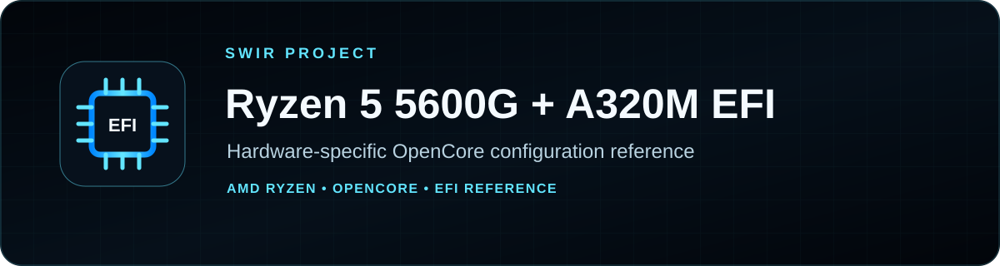
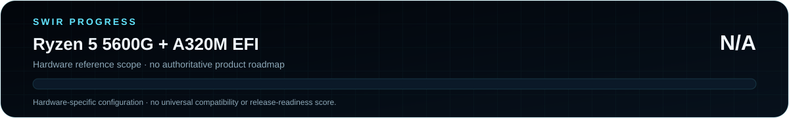

<!-- SWIR-README-STANDARD:v2 -->

<div align="center">



<br>


<br>


[**Overview**](#-overview) · [**Safety**](#%EF%B8%8F-safety--before-use) · [**Status**](STATUS.md) · [**Repository Structure**](#-repository-structure)

</div>


## 📍 Project Status

| Item | Status |
|---|---|
| Repository type | Hardware-specific EFI / OpenCore reference |
| Primary CPU family | AMD Ryzen 5 5600G |
| Board family named by repository | A320M |
| Public GitHub release | **Not published** |
| Product roadmap | Not defined; completion is intentionally **N/A** |
| Detailed status | [STATUS.md](STATUS.md) |



**Product progress: N/A.** This repository is a hardware-specific configuration reference, not a product with an authoritative completion roadmap.

## 🚀 Overview

This repository contains an **OpenCore EFI reference** for a system built around an AMD Ryzen 5 5600G and an A320M-class motherboard. The checked-in EFI tree includes OpenCore configuration/binaries and supporting ACPI/kext resources; the `Results/` directory contains generated ACPI-related material used during configuration work.

The repository is useful as a **reference for a similar build**, not as a universal drop-in EFI. Hardware details such as exact motherboard model/revision, firmware settings, graphics, networking, USB mapping and macOS/OpenCore compatibility materially affect whether a configuration is safe and bootable.

## ✨ What Is Included

| Area | Repository content |
|---|---|
| EFI boot tree | `EFI/BOOT/` and `EFI/OC/` |
| OpenCore configuration | `EFI/OC/config.plist` plus an install-oriented configuration |
| ACPI / drivers / kexts | Stored under the OpenCore tree |
| OpenCore binary | `EFI/OC/OpenCore.efi` |
| Supporting results | DSDT/SSDT and related material under `Results/` |

This migration does not modify EFI behavior, firmware settings, binaries, kexts or configuration values.

## ⚠️ Safety / Before Use

Before placing this EFI on a machine:

- back up your current working EFI partition;
- confirm the **exact** motherboard model/revision and current BIOS/UEFI settings;
- inspect `EFI/OC/config.plist` instead of copying it blindly;
- use your own appropriate SMBIOS/identity values where required;
- verify USB mapping and network/audio/GPU assumptions for your hardware;
- keep known-good recovery media available;
- prefer testing from a separate removable EFI before replacing a working boot setup.

A configuration that boots one Ryzen/A320M system can fail on another system with different firmware or peripherals.

## 🍎 macOS / Licensing Note

This repository does **not** distribute macOS. Obtain Apple software only through official Apple channels and review the applicable license terms for your intended use.

The repository currently has no top-level `LICENSE` file. Bundled OpenCore, drivers, kexts and other third-party components can have their own upstream licenses; review those upstream terms before redistribution.

## ⚙️ Usage / Workflow

There is no installer or one-click release in this repository. A careful reference workflow is:

1. inspect the checked-in EFI and compare it with your exact hardware;
2. review `config.plist`, ACPI, drivers and kext selection;
3. replace machine-specific identity/configuration values as required;
4. keep your original EFI backup;
5. test from separate boot media before making a permanent replacement.

Do not treat this repository as a guarantee of macOS compatibility.

## 📁 Repository Structure

```text
Ryzen-5-5600G-A320M-/
├── EFI/
│   ├── BOOT/
│   └── OC/
│       ├── ACPI/
│       ├── Drivers/
│       ├── Kexts/
│       ├── Resources/
│       ├── Tools/
│       ├── OpenCore.efi
│       └── config.plist
├── Results/
│   └── DSDT / SSDT and related configuration results
├── STATUS.md
└── README.md
```

## 🗺️ Roadmap / Progress

No authoritative product roadmap exists for this configuration reference. Product completion is therefore **N/A**, rather than being inferred from the presence of an EFI tree or historical test material.

## 📦 Releases

There are currently **no GitHub Releases** for this repository. Use the repository contents as a reference and review every hardware-specific setting before use.

## 🔎 Search Keywords

`ryzen 5 5600g opencore` • `a320m opencore efi` • `amd opencore configuration` • `ryzen hackintosh efi reference` • `opencore config plist amd` • `a320m efi reference` • `amd ryzen efi` • `opencore acpi ssdt` • `ryzen 5600g bootloader configuration` • `hardware specific efi`


<div align="center">

### `BACK UP • VERIFY HARDWARE • TEST SAFELY`

⭐ **If this reference helps your own research, consider leaving a star.**

[**← SWIR profile**](https://github.com/Swir) · [**All projects →**](https://github.com/Swir?tab=repositories)

</div>
